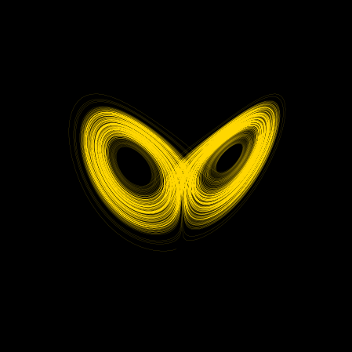

# Lorenz-System

Illustration of the onset of chaos in the Lorez system of differential equations.

# Theory

## The Lorenz System of Differential Equations

The Lorenz system is arised in a simplified description of atmospheric convection and probably the best known example of chaotic system. It is defined by the following system of differential equations:

$$ \frac{dx}{dt} = \sigma \left( y - x \right), $$

$$ \frac{dy}{dt} = x \left( \rho - z \right)  - y, $$

$$ \frac{dz}{dt} = xy - \beta z.$$

$\alpha, \beta \text{ and } \sigma$ are parameters of the system.

## Chaos

The defining property of chaotic systems is **approximate initial conditions cannot predict approximate futures whereas exact initial conditions can predict exact future**.

The popular notion of the butterfy effect (the flap of a butterfly's wing affecting a tornado weeks later) is a metaphorical version of this phenomenon of sensitive dependence on initial conditions. The shape of the solutions also resmble a butterfly to the romanticization's merit.

The above is the solution for the system for the initial condition $[1, 1, 1]$.

# Simulation
